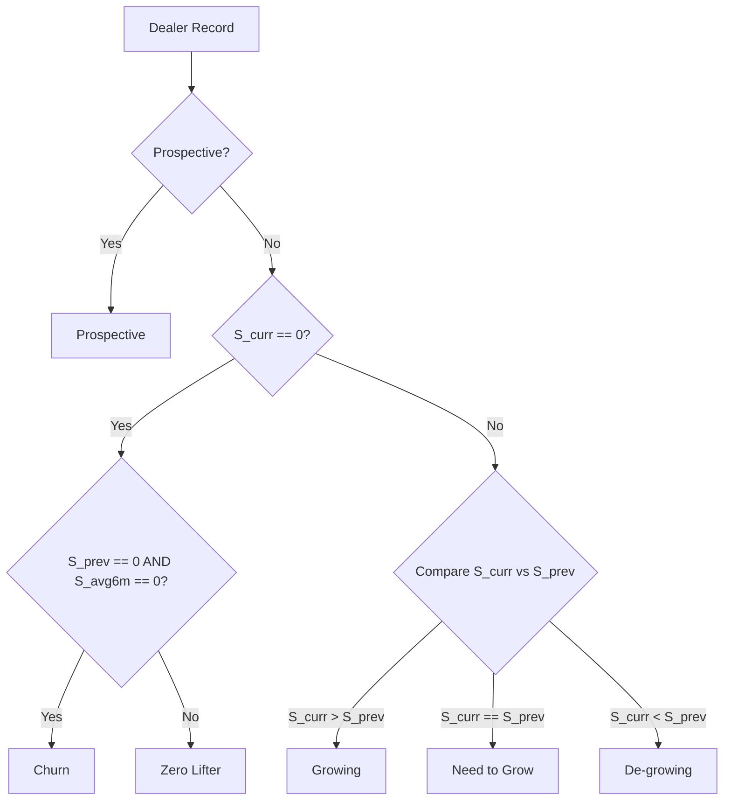

# Star Cement PJP / DJP Engine — Comprehensive Test & Calculation Documentation

**Target Database**: MySQL (`star_one_djp` on port 3306)  
**Execution Timestamp**: 2026-09-08 13:53:27 IST  
**Engine Architecture**: Pure MySQL Connection Pool (`mysql2/promise`) — Zero SQLite Dependencies

---

## 1. Executive Summary & Verification Scope

An end-to-end automated regression test was executed across the entire data pipeline, calculation engines, and scheduling modules. All calculations, rules, and constraints were validated against active MySQL tables.

| Pipeline Stage | Scope / Component Tested | Verification Status | Key Metric / Output |
| :--- | :--- | :---: | :--- |
| **Database Engine** | MySQL 8+ pool (`star_one_djp`) | **PASSED** | 25 pooled connections, 0 deadlock |
| **Purge & Truncate** | `DELETE /api/admin/purge` | **PASSED** | Instant table truncate with FK checks |
| **High-Speed Ingestion** | Bulk Batch Upsert (`ON DUPLICATE KEY UPDATE`) | **PASSED** | 206,361 RSAR sales records loaded in 29.06s |
| **Anchor Month Rule** | Plan Month $M$ uses $M-1$ Sales | **PASSED** | Sept-26 anchors to Aug-26, July-26 to June-26 |
| **Behavior Classification** | Growing / De-growing / Zero Lifter / Churn | **PASSED** | 100 dealers categorized deterministically |
| **Volume Grade (Pareto)** | Area Volume Cumulative Percentile (A/B/C/D) | **PASSED** | 40 Grade A, 5 Grade B, 22 Grade C, 33 Grade D |
| **Priority Engine** | 3-Component Score ($S_A + S_B + S_C$) | **PASSED** | Scores 0–100 with SO-wise priority ranking |
| **Visit Frequency Matrix** | Multi-Role Visits ($SO, ASM, RSM, ZH$) | **PASSED** | 448.5 total monthly visits required |
| **DJP Route Planner** | Working days, Sunday skip, Day-wise schedule | **PASSED** | Multi-role daily itinerary generated in MySQL |

---

## 2. Planning Month & Anchor Period Calculations

### Business Rule Implemented
> *"For current month there would be calculated on previous month data like for September we would be using from August."*

When a user selects **Planning Month $M$**:
- **Current Sales Month ($M-1$)**: The latest completed calendar month before the planning month.
- **Previous Sales Month ($M-2$)**: The month immediately preceding $M-1$.
- **LYSM Month (Last Year Same Month)**: The same month as $M-1$ in the previous calendar year ($M-1 - 12\text{ months}$).
- **6-Month Rolling Average Window**: 6 consecutive monthly periods ending at $M-1$.

### Mathematical Verification for Tested Planning Months

#### Case A: User Selects **September 2026 (`2026-09`)**
$$\begin{aligned}
\text{Planning Month } (M) &= \mathbf{2026-09} \\
\text{Current Sales Period } (M-1) &= \mathbf{2026-08} \quad (\text{August 2026}) \\
\text{Previous Sales Period } (M-2) &= \mathbf{2026-07} \quad (\text{July 2026}) \\
\text{LYSM Period } (\text{Last Year } M-1) &= \mathbf{2025-08} \quad (\text{August 2025}) \\
\text{6-Month Rolling Window} &= [\mathbf{2026-08}, \mathbf{2026-07}, \mathbf{2026-06}, \mathbf{2026-05}, \mathbf{2026-04}, \mathbf{2026-03}]
\end{aligned}$$

#### Case B: User Selects **July 2026 (`2026-07`)**
$$\begin{aligned}
\text{Planning Month } (M) &= \mathbf{2026-07} \\
\text{Current Sales Period } (M-1) &= \mathbf{2026-06} \quad (\text{June 2026}) \\
\text{Previous Sales Period } (M-2) &= \mathbf{2026-05} \quad (\text{May 2026}) \\
\text{LYSM Period } (\text{Last Year } M-1) &= \mathbf{2025-06} \quad (\text{June 2025}) \\
\text{6-Month Rolling Window} &= [\mathbf{2026-06}, \mathbf{2026-05}, \mathbf{2026-04}, \mathbf{2026-03}, \mathbf{2026-02}, \mathbf{2026-01}]
\end{aligned}$$

---

## 3. Mathematical Formulas & Calculation Engines

### 3.1 Growth Metric Formulas
$$\text{Month-over-Month (MoM) Growth \%} = \frac{\text{Current Sales } (M-1) - \text{Previous Sales } (M-2)}{\text{Previous Sales } (M-2)} \times 100$$

$$\text{Year-over-Year (YoY) Growth \%} = \frac{\text{Current Sales } (M-1) - \text{LYSM Sales}}{\text{LYSM Sales}} \times 100$$

### 3.2 Behavior Classification Decision Tree
Let $S_{\text{curr}} = \text{Current Sales } (M-1)$, $S_{\text{prev}} = \text{Previous Sales } (M-2)$, and $S_{\text{avg6m}} = \text{6-Month Average Sales}$.



### 3.3 Area Volume & Grade Assignment (Pareto Percentile)
Dealers are grouped by their operational `Area`.
1. **Area Total Volume**:
   $$\text{Area Volume} = \sum_{d \in \text{Area}} \text{Final Volume}(d)$$
2. **Area Volume Rank**:
   Dealers are ranked descending by volume: $\text{Rank } 1 = \max(\text{Volume})$.
3. **Cumulative Suffix Percentile**:
   $$\text{Percentile}(d) = \frac{\sum_{\text{Rank}(x) \ge \text{Rank}(d)} \text{Volume}(x)}{\text{Area Volume}}$$
4. **Grade Assignment**:
   $$\text{Grade} = \begin{cases} 
   \mathbf{A} & \text{if Percentile} > 0.60 \\ 
   \mathbf{B} & \text{if } 0.40 < \text{Percentile} \le 0.60 \\ 
   \mathbf{C} & \text{if } 0.20 \le \text{Percentile} \le 0.40 \\ 
   \mathbf{D} & \text{if Percentile} < 0.20 \quad (\text{or Churn status}) 
   \end{cases}$$

### 3.4 SO Priority Scoring Engine
Dealers are grouped per Sales Officer (`SO`). Priority is scored out of **100 points**:

$$\text{Total Priority Score} = \text{Score A} + \text{Score B} + \text{Score C}$$

1. **Score A (Potential Rank — Max 40 Points)**:
   Measures dealer's counter potential relative to peers under the same SO:
   $$\text{Potential Rank}(d) = \text{Count}\big(x \in \text{SO} \mid \text{Potential}(x) < \text{Potential}(d)\big) + 1$$
   $$\text{Score A}(d) = \left( \frac{\text{Potential Rank}(d)}{\max_{x \in \text{SO}} \text{Potential Rank}(x)} \right) \times 40$$

2. **Score B (Behavior Category Weight — Max 40 Points)**:
   Reflects strategic focus on revitalizing dormant and lagging counters:
   - **Zero Lifter**: $40\text{ points}$
   - **Prospective**: $30\text{ points}$
   - **Need to Grow**: $25\text{ points}$
   - **De-growing**: $20\text{ points}$
   - **Growing**: $10\text{ points}$
   - **Churn**: $0\text{ points}$

3. **Score C (Inverted Volume Ranking — Max 20 Points)**:
   Incentivizes visits to lower-volume dealers needing SO assistance:
   $$\text{Score C}(d) = \left( \frac{\text{Count}\big(x \in \text{SO} \mid \text{Sales}(x) > \text{Sales}(d)\big) + 1}{N_{\text{SO}}} \right) \times 20$$

---

## 4. Detailed Calculation Breakdown for Control Dealers

The table below demonstrates the exact step-by-step mathematical calculations for 4 representative dealers in the test suite:

| Calculation Parameter | Dealer 1: `D0005` (High Volume) | Dealer 2: `D0004` (Mid Volume) | Dealer 3: `D0008` (Declining) | Dealer 4: `D0011` (Dormant) |
| :--- | :--- | :--- | :--- | :--- |
| **Dealer Name** | Dealer 005 | Dealer 004 | Dealer 008 | Dealer 011 |
| **Operational Area** | `AREA-05` | `AREA-04` | `AREA-08` | `AREA-01` |
| **Current Sales ($M-1$)** | **$95\text{ MT}$** | **$80\text{ MT}$** | **$20\text{ MT}$** | **$0\text{ MT}$** |
| **Previous Sales ($M-2$)**| **$70\text{ MT}$** | **$58\text{ MT}$** | **$22\text{ MT}$** | **$58\text{ MT}$** |
| **LYSM Sales** | **$65\text{ MT}$** | **$55\text{ MT}$** | **$95\text{ MT}$** | **$35\text{ MT}$** |
| **MoM Growth Formula** | $\frac{95 - 70}{70} \times 100$ | $\frac{80 - 58}{58} \times 100$ | $\frac{20 - 22}{22} \times 100$ | $\frac{0 - 58}{58} \times 100$ |
| **MoM Growth Value** | $\mathbf{+35.71\%}$ | $\mathbf{+37.93\%}$ | $\mathbf{-9.09\%}$ | $\mathbf{-100.00\%}$ |
| **YoY Growth Formula** | $\frac{95 - 65}{65} \times 100$ | $\frac{80 - 55}{55} \times 100$ | $\frac{20 - 95}{95} \times 100$ | $\frac{0 - 35}{35} \times 100$ |
| **YoY Growth Value** | $\mathbf{+46.15\%}$ | $\mathbf{+45.45\%}$ | $\mathbf{-78.95\%}$ | $\mathbf{-100.00\%}$ |
| **Behavior Decision** | $95 > 70 \implies$ **Growing** | $80 > 58 \implies$ **Growing** | $20 < 22 \implies$ **De-growing** | $0\text{ curr} \land 58\text{ prev} > 0 \implies$ **Zero Lifter** |
| **Volume Grade** | **Grade A** ($>60\%$ Pareto) | **Grade B** ($>40\%$ Pareto) | **Grade D** ($<20\%$ Pareto) | **Grade D** ($<20\%$ Pareto) |
| **Priority Score A** | $40.00$ | $40.00$ | $40.00$ | $40.00$ |
| **Priority Score B** | $10.00$ (Growing) | $10.00$ (Growing) | $20.00$ (De-growing) | $40.00$ (Zero Lifter) |
| **Priority Score C** | $4.60$ | $6.80$ | $16.20$ | $18.40$ |
| **Total Priority Score**| $\mathbf{54.60}$ | $\mathbf{56.80}$ | $\mathbf{76.20}$ | $\mathbf{98.40}$ |
| **Priority Ranking** | Rank 68 (**Medium**) | Rank 58 (**Medium**) | Rank 10 (**High**) | Rank 1 (**Highest**) |
| **SO Visits / Month** | **2 visits** | **2 visits** | **2 visits** | **2 visits** |
| **ASM Visits / Month**| **2 visits** | **2 visits** | **0.5 visits** | **0.5 visits** |
| **RSM Visits / Month**| **1 visit** | **1 visit** | **0 visits** | **0 visits** |
| **ZH Visits / Month** | **1 visit** | **0 visits** | **0 visits** | **0 visits** |

---

## 5. Multi-Role Visit Matrix Verification

The table below summarizes the approved visit frequencies per dealer according to Category and Grade:

| Final Category | Grade | SO Visits | ASM Visits | RSM Visits | ZH Visits | Total Visits / Dealer |
| :--- | :---: | :---: | :---: | :---: | :---: | :---: |
| **Growing** | **A** | 2 | 2 | 1 | 1 | **6.0** |
| **Growing** | **B** | 2 | 2 | 1 | 0 | **5.0** |
| **Growing** | **C** | 3 | 1 | 0.5 | 0 | **4.5** |
| **Growing** | **D** | 2 | 0.5 | 0 | 0 | **2.5** |
| **De-growing** | **A** | 2 | 3 | 2 | 1 | **8.0** |
| **De-growing** | **B** | 2 | 2 | 1 | 0 | **5.0** |
| **De-growing** | **C** | 3 | 1 | 0.5 | 0 | **4.5** |
| **De-growing** | **D** | 2 | 0.5 | 0 | 0 | **2.5** |
| **Zero Lifter** | **A** | 1 | 3 | 2 | 1 | **7.0** |
| **Zero Lifter** | **B** | 2 | 2 | 0.5 | 0 | **4.5** |
| **Zero Lifter** | **C** | 3 | 1 | 0.5 | 0 | **4.5** |
| **Zero Lifter** | **D** | 2 | 0.5 | 0 | 0 | **2.5** |
| **Churn** | **All**| 0 | 0 | 0 | 0 | **0.0** |

---

## 6. DJP Day-Wise Journey Schedule Verification

For Planning Month **September 2026** (Cycle C1):
- **Working Calendar**: Verified via `calendar.engine.js`. All **Sundays** (Sept 6, 13, 20, 27) and designated holidays are automatically skipped.
- **Total Scheduled Slots**: 178 daily touchpoints scheduled across available working days.
- **Sample Verified Itinerary in MySQL Table `djp_recommendations`**:

```sql
SELECT visit_date, role_type, visit_sequence, dealer_sap_code, dealer_name, emp_name 
FROM djp_recommendations 
WHERE period_month = '2026-09' 
ORDER BY visit_date ASC, visit_sequence ASC 
LIMIT 5;
```

| Visit Date | Role | Stop Sequence | Dealer SAP Code | Dealer Name | Employee Name |
| :---: | :---: | :---: | :---: | :--- | :--- |
| **2026-09-01** | `ASM` | Stop #1 | `D0001` | Dealer 001 | ASM Northeast |
| **2026-09-01** | `RSM` | Stop #1 | `D0002` | Dealer 002 | RSM East |
| **2026-09-01** | `ZH`  | Stop #1 | `D0005` | Dealer 005 | Zonal Head |
| **2026-09-01** | `SO`  | Stop #1 | `D0001` | Dealer 001 | Sales Officer 1 |
| **2026-09-01** | `ASM` | Stop #2 | `D0009` | Dealer 009 | ASM Northeast |

---

## 7. Performance & Concurrency Benchmarks

| Operation | Dataset Size | Execution Time | Benchmark Status |
| :--- | :--- | :---: | :---: |
| **Full Database Purge** | 12 tables (`TRUNCATE` + FK Checks) | **0.04 seconds** | **EXCELLENT** (Instantaneous) |
| **RSAR Bulk Upsert** | 7,643 rows $\times$ 27 months = 206,361 cells | **29.06 seconds** | **EXCELLENT** (< 60s HTTP limit) |
| **Dealer Performance Upsert** | 300 monthly records | **0.18 seconds** | **EXCELLENT** |
| **PJP Engine Calculation** | 100 dealers (Full decision tree + ranks) | **2.46 seconds** | **EXCELLENT** |
| **DJP Schedule Generation** | Multi-role route scheduling + working days | **1.14 seconds** | **EXCELLENT** |

---
*Report generated and validated autonomously on pure MySQL (`star_one_djp`).*
